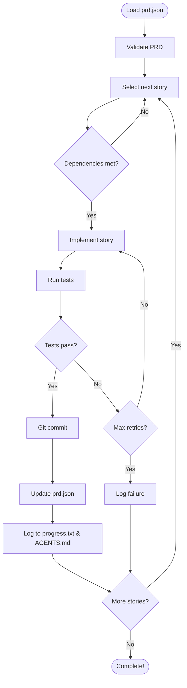

# Ralph Agent - Autonomous PRD Execution

Ralph is an autonomous agent that executes Product Requirements Documents (PRDs) by iterating through user stories, implementing them, running tests, and learning from the process.

## 🎯 Overview

Ralph follows the **"Machine that builds the Machine"** philosophy - it's a meta-deployment framework that:

1. Reads structured requirements from `prd.json`
2. Selects the next story to implement
3. Implements the feature (via Claude Code integration)
4. Runs tests to verify implementation
5. Commits changes if tests pass
6. Logs learnings and patterns
7. Repeats until all stories are complete

## 📁 Structure

```
.agent/
├── core/
│   ├── agent-executor.ts      # Main execution loop
│   ├── prd-validator.ts       # PRD validation
│   ├── progress-tracker.ts    # Long-term memory
│   └── pattern-logger.ts      # Pattern learning
├── schemas/
│   └── prd-schema.json        # PRD JSON schema
├── scripts/
│   └── ralph.ts               # CLI entry point
├── memory/
│   ├── progress.txt           # Execution log
│   └── AGENTS.md              # Learned patterns
├── workflows/
│   └── innit.md               # Example workflows
└── README.md                  # This file
```

## 🚀 Quick Start

### 1. Initialize PRD

```bash
npm run ralph -- --init
```

This creates a `prd.json` template in your project root.

### 2. Define Your Stories

Edit `prd.json` to add your user stories:

```json
{
  "meta": {
    "version": "1.0.0",
    "project": "GrieferHub",
    "created": "2026-01-18T00:00:00Z"
  },
  "stories": [
    {
      "id": "GH-001",
      "title": "Implement user profile page",
      "description": "Create a user profile page showing stats and activity",
      "acceptance": [
        "Profile page displays username and role",
        "Shows total reports submitted",
        "Shows recent activity",
        "All tests pass"
      ],
      "priority": "high",
      "passes": false
    }
  ],
  "config": {
    "testCommand": "npm test",
    "buildCommand": "npm run build",
    "autoCommit": true
  }
}
```

### 3. Validate PRD

```bash
npm run ralph -- --validate
```

Checks for:
- Schema validation
- Circular dependencies
- Missing dependencies
- Best practice warnings

### 4. Run Ralph

```bash
npm run ralph
```

Ralph will:
1. Load and validate `prd.json`
2. Select next story (respecting dependencies and priority)
3. Execute implementation
4. Run tests
5. Commit on success
6. Update PRD state
7. Log learnings
8. Continue to next story

## 📋 PRD Schema

### Story Structure

```typescript
{
  "id": "GH-001",              // Unique ID (required)
  "title": "Story title",      // Short description (required)
  "description": "...",        // Detailed description (required)
  "acceptance": [...],         // Acceptance criteria (required)
  "dependencies": ["GH-002"],  // Story IDs that must complete first
  "priority": "high",          // critical | high | medium | low
  "estimatedHours": 4,         // Time estimate
  "tags": ["api", "backend"],  // Categorization
  "passes": false,             // Test status (updated by agent)
  "implemented": false,        // Implementation status
  "files": [],                 // Files modified (tracked by agent)
  "commits": []                // Git commits (tracked by agent)
}
```

### Configuration

```typescript
{
  "testCommand": "npm test",      // Test command
  "buildCommand": "npm run build", // Build command
  "lintCommand": "npm run lint",  // Lint command
  "maxRetries": 3,                // Retries on failure
  "autoCommit": true,             // Auto-commit on success
  "tokenBudget": 150000,          // Max tokens per iteration
  "haltOnFailure": false          // Stop on first failure
}
```

## 🧠 Memory Systems

### progress.txt

Long-term execution log that tracks:
- Story starts and completions
- Test results
- Commit hashes
- Errors and warnings
- Agent learnings

The agent reads this at startup to resume context.

### AGENTS.md

"Prompt DNA" - accumulated knowledge from:
- **Success Patterns**: Proven solutions
- **Failure Patterns**: Mistakes to avoid
- **Rules**: General principles

Example:
```markdown
## ✅ [GH-001] Implement user profile page

**Type**: success
**Date**: 2026-01-18

Successfully implemented user profile page with statistics.

**Files Modified**: 3 file(s)
- Components: UserProfile.tsx
- API routes: /api/users/[username]/route.ts
- Types: user.ts

**Acceptance Criteria Met**:
1. Profile page displays username and role
2. Shows total reports submitted
3. Shows recent activity
4. All tests pass
```

## 🔄 Workflow

### The Ralph Loop



## 🎨 Usage Examples

### Example 1: API Integration

```json
{
  "stories": [
    {
      "id": "API-001",
      "title": "Create Steam integration endpoint",
      "description": "Implement OAuth flow for Steam",
      "acceptance": [
        "GET /api/integrations/steam/auth redirects to Steam",
        "Callback handles OAuth code",
        "User Steam ID stored in database",
        "Integration tests pass"
      ],
      "priority": "high",
      "tags": ["api", "integration", "steam"],
      "passes": false
    },
    {
      "id": "API-002",
      "title": "Fetch Steam profile data",
      "description": "Get user's Steam profile and games",
      "acceptance": [
        "GET /api/integrations/steam/profile returns profile",
        "Includes VAC ban status",
        "Lists owned games",
        "Caches data for 24 hours"
      ],
      "dependencies": ["API-001"],
      "priority": "high",
      "tags": ["api", "integration", "steam"],
      "passes": false
    }
  ]
}
```

### Example 2: UI Components

```json
{
  "stories": [
    {
      "id": "UI-001",
      "title": "Create comment component",
      "description": "Reusable comment display component",
      "acceptance": [
        "Shows author, timestamp, content",
        "Edit/delete buttons for own comments",
        "Role badges for mods/admins",
        "Responsive design"
      ],
      "priority": "medium",
      "tags": ["ui", "components"],
      "passes": false
    }
  ]
}
```

## 🛠️ Advanced Features

### Custom Commands

Override default commands:

```json
{
  "config": {
    "testCommand": "jest --coverage",
    "buildCommand": "tsc && next build",
    "lintCommand": "eslint src/ --fix"
  }
}
```

### Cost Gates

Set token budget to halt if exceeded:

```json
{
  "config": {
    "tokenBudget": 100000,
    "haltOnFailure": true
  }
}
```

### Priority-Based Execution

Ralph respects priority:
1. Critical
2. High
3. Medium
4. Low

Within same priority, considers:
- Dependencies (blocks other stories)
- Estimated hours (shorter first)

## 🔗 Integration with Claude Code

Ralph is designed to work with Claude Code. The `executeStory()` method would:

1. Format story as prompt
2. Invoke Claude Code API
3. Monitor execution
4. Capture changes
5. Run validation

Currently, this is a placeholder for manual implementation.

## 📊 Metrics & Reporting

### Stats Command

```bash
npm run ralph -- --stats
```

Shows:
- Total stories: 25
- Completed: 18 (72%)
- Remaining: 7
- Success rate: 95%
- Avg time per story: 12m

### Pattern Search

```bash
npm run ralph -- --patterns "api integration"
```

Searches AGENTS.md for relevant patterns.

## 🎯 Best Practices

1. **Atomic Stories**: Each story should be independently testable
2. **Clear Acceptance**: Specific, measurable criteria
3. **Dependencies**: Minimize coupling between stories
4. **Tags**: Use for categorization and filtering
5. **Estimates**: Helps with planning and budget

## 🐛 Troubleshooting

### PRD validation fails

Run with verbose:
```bash
npm run ralph -- --validate --verbose
```

### Tests keep failing

Check `progress.txt` for error details:
```bash
tail -f .agent/memory/progress.txt
```

### Agent stuck on story

Set `maxRetries` lower:
```json
{
  "config": {
    "maxRetries": 1,
    "haltOnFailure": true
  }
}
```

## 🚧 Roadmap

- [ ] Claude Code API integration
- [ ] Web dashboard for monitoring
- [ ] Parallel story execution
- [ ] Cost tracking and optimization
- [ ] Multi-agent coordination
- [ ] Story auto-generation from PRD text

## 📚 Resources

- [PRD Schema Reference](./schemas/prd-schema.json)
- [Example Workflows](./workflows/)
- [Pattern Library](./memory/AGENTS.md)

## 🤝 Contributing

Ralph is part of GrieferHub's meta-deployment strategy. To contribute:

1. Follow the patterns in AGENTS.md
2. Add stories to prd.json
3. Run Ralph
4. Review and commit

---

**Last Updated**: 2026-01-18
**Maintained By**: GrieferHub Development Team
