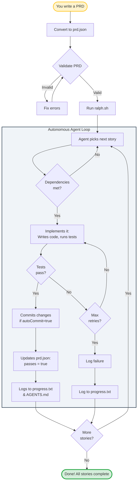
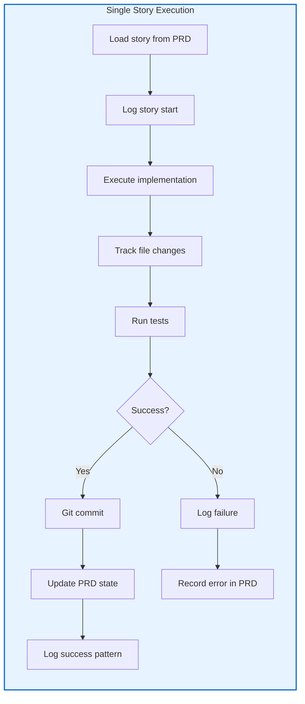
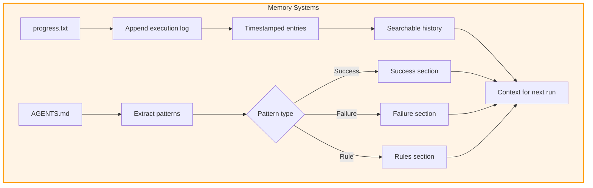
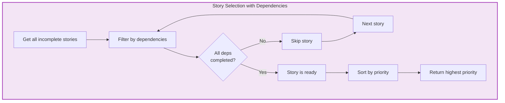
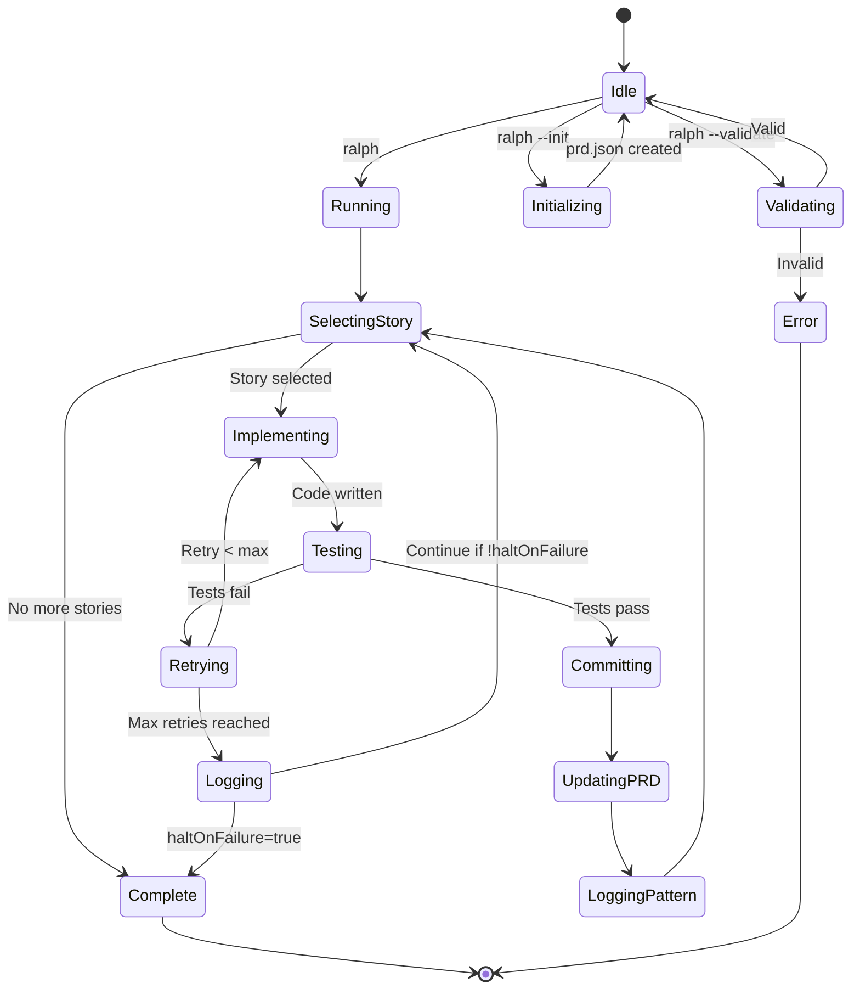

# Ralph Agent Workflow Guide

This guide provides visual workflows and integration patterns for the Ralph autonomous agent.

## 📋 Workflowy Outline

**Copy this outline into Workflowy for high-level project tracking:**

```
* Ralph Agent: Autonomous PRD Execution #ralph #automation #workflow
  * Initialization Phase
    * Define PRD: Outline core requirements and goals
    * Convert to prd.json: Break down the PRD into structured user stories with unique IDs and acceptance criteria
    * Bootstrapping: Initialize progress.txt for long-term memory and AGENTS.md for pattern logging
    * Validation: Run ralph --validate to ensure PRD integrity

  * The Ralph Loop (ralph.ts)
    * Start Loop: Execute the autonomous script to begin the cycle
    * Selection: Agent scans prd.json to find the next story where passes: false
      * Check dependencies are met
      * Sort by priority (critical > high > medium > low)
      * Select highest priority ready story
    * Implementation: Agent writes code, runs tests, and executes the specific task
      * Invoke Claude Code (or manual implementation)
      * Monitor file changes
      * Track implementation progress

  * Verification & Learning
    * Testing: Run configured test command
      * npm test (or custom command)
      * Capture test output
      * Determine pass/fail status
    * Build: Optionally run build to ensure compilation
    * Lint: Optionally run linter for code quality
    * Commit: If tests pass, the agent performs a Git commit
      * Generate commit message from story
      * Include Co-Authored-By tag
      * Get commit hash
    * Update State: Set passes: true in prd.json for the completed story
      * Mark implemented: true
      * Add commit hash to story
      * Record completion timestamp
    * Log Progress: Save technical learnings and discovered patterns
      * Append to progress.txt with timestamps
      * Extract patterns for AGENTS.md
      * Categorize success/failure patterns

  * Termination
    * Story Check: Determine if more stories remain in prd.json
    * Completion: Once all stories are marked passes: true, the agent signals "Done!"
    * Summary: Display statistics and review files
      * Total stories completed
      * Success rate
      * Time metrics
      * Point to progress.txt and AGENTS.md

  * Error Handling
    * Retry Logic: On test failure, retry up to maxRetries times
    * Error Logging: Record errors in story.errors array
    * Halt Conditions: Optionally stop on first failure (haltOnFailure: true)
    * Recovery: Manual intervention possible at any point

  * Memory Systems
    * progress.txt: Long-term execution log
      * All agent activities logged with timestamps
      * Read at startup for context resumption
      * Searchable history
    * AGENTS.md: Pattern knowledge base
      * Success patterns: What worked
      * Failure patterns: What to avoid
      * Rules: General principles
      * Categorized by tags
```

## 🔄 Mermaid Workflow Diagrams

### Main Ralph Loop



### Story Execution Detail



### Memory System Flow



### Dependency Resolution



## 🎯 Integration Patterns

### Pattern 1: Manual Implementation Mode

When Claude Code integration is not available:

```
1. Ralph selects next story
2. Ralph outputs story details to console
3. Developer implements manually
4. Developer runs tests: npm test
5. If tests pass:
   - Ralph detects success
   - Ralph commits changes
   - Ralph updates PRD
6. Ralph selects next story
```

### Pattern 2: Fully Autonomous Mode

With Claude Code API integration:

```
1. Ralph selects next story
2. Ralph formats story as prompt
3. Ralph invokes Claude Code API
4. Claude Code implements feature
5. Ralph monitors file changes
6. Ralph runs tests automatically
7. On success: commit, update, continue
8. On failure: retry or log error
```

### Pattern 3: Hybrid Mode

Semi-automated with checkpoints:

```
1. Ralph selects and displays story
2. User approves/modifies story
3. Ralph proceeds with implementation
4. Tests run automatically
5. User reviews changes before commit
6. Ralph commits and continues
```

## 📊 State Diagram



## 🔧 Integration with Obsidian

### Daily Note Template

```markdown
# Ralph Agent Log - {{date}}

## Stories Completed Today
- [ ] Review completed stories
- [ ] Check AGENTS.md for new patterns

## Active Story
**ID**:
**Title**:
**Status**:

## Learnings
{{content from AGENTS.md}}

## Next Steps
- [ ]
```

### Obsidian Query

```dataview
TABLE
  story.id AS "ID",
  story.title AS "Title",
  story.passes AS "Complete"
FROM "prd.json"
WHERE story.passes = false
SORT story.priority DESC
```

## 🎨 Cost-Gate Pattern

Prevent runaway costs with token budget:

```json
{
  "config": {
    "tokenBudget": 100000,
    "haltOnFailure": true
  }
}
```

Ralph will:
1. Track tokens used per story
2. Halt if budget exceeded
3. Output "Debrief" for Workflowy

## 🚀 Meta-Workflow: Machine Building Machine

### Phase 1: Bootstrap
```
1. Create .agent/ infrastructure
2. Initialize progress.txt and AGENTS.md
3. Define prd.json schema
4. Validate setup
```

### Phase 2: Learning
```
1. Execute first story manually
2. Capture patterns in AGENTS.md
3. Refine PRD based on learnings
4. Update acceptance criteria
```

### Phase 3: Automation
```
1. Integrate Claude Code API
2. Enable autonomous execution
3. Monitor and adjust
4. Scale to parallel execution
```

### Phase 4: Meta
```
1. Ralph generates its own improvements
2. Ralph updates its own PRD
3. Self-optimizing agent
4. Continuous deployment
```

## 📈 Success Metrics

Track these in progress.txt:

- **Velocity**: Stories completed per day
- **Success Rate**: % of stories passing on first try
- **Retry Rate**: Avg retries per story
- **Pattern Growth**: New patterns learned per week
- **Token Efficiency**: Tokens per story

## 🔗 External Integrations

### GitHub Actions

```yaml
name: Ralph Agent
on:
  schedule:
    - cron: '0 */6 * * *'  # Every 6 hours
  workflow_dispatch:

jobs:
  ralph:
    runs-on: ubuntu-latest
    steps:
      - uses: actions/checkout@v2
      - name: Run Ralph
        run: npm run ralph
      - name: Commit changes
        run: |
          git config user.name "Ralph Agent"
          git commit -am "feat: Ralph autonomous update"
          git push
```

### Slack Notifications

```typescript
// In agent-executor.ts
async notifySlack(message: string) {
  await fetch(process.env.SLACK_WEBHOOK, {
    method: 'POST',
    body: JSON.stringify({ text: message })
  });
}
```

---

**Last Updated**: 2026-01-18
**Maintained By**: GrieferHub Development Team
