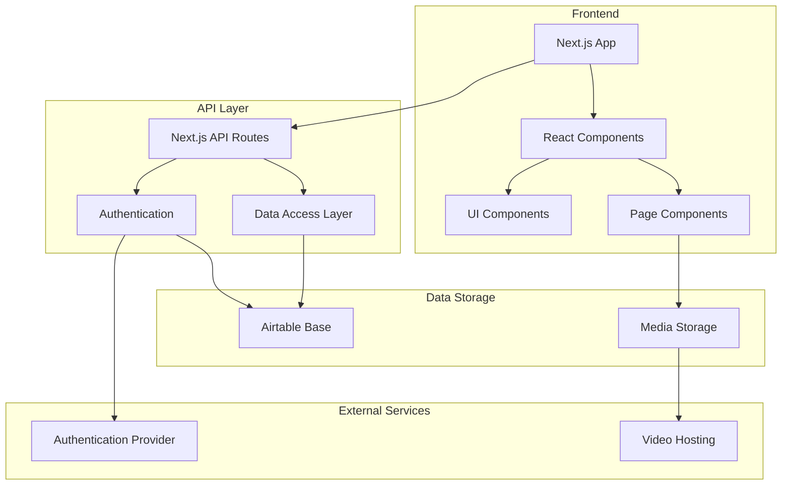
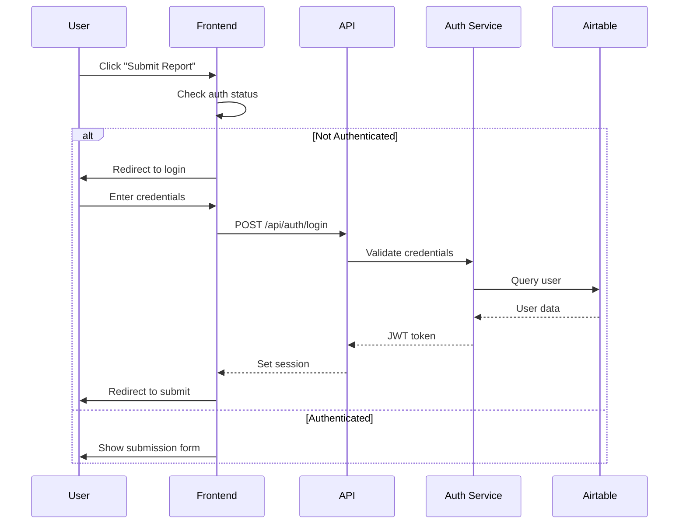

# GrieferHub Architecture

## 🏗️ System Architecture Overview



## 📦 Component Architecture

### Frontend Layer

#### Pages (App Router)

- **`/`** - Intel Board (Public Home)
- **`/report/[id]`** - Report Detail Page
- **`/submit`** - Report Submission (Gated)
- **`/dashboard`** - User Dashboard (Gated)
- **`/admin`** - Admin/Mod Dashboard (Gated)

#### Core Components

```
components/
├── layout/
│   ├── Header.tsx              # Navigation, user menu
│   ├── Footer.tsx              # Footer with links
│   └── Sidebar.tsx             # Filter sidebar
├── reports/
│   ├── ReportCard.tsx          # Report preview card
│   ├── ReportList.tsx          # Paginated list
│   ├── ReportDetail.tsx        # Full report view
│   ├── ReportForm.tsx          # Submission form
│   └── StatusBadge.tsx         # Status indicator
├── filters/
│   ├── GameFilter.tsx          # Game selection
│   ├── StatusFilter.tsx        # Status selection
│   ├── SeverityFilter.tsx      # Severity selection
│   └── SearchBar.tsx           # Text search
├── media/
│   ├── VideoPlayer.tsx         # Evidence video player
│   └── ImageGallery.tsx        # Image evidence
└── common/
    ├── Button.tsx              # Reusable button
    ├── Input.tsx               # Form inputs
    ├── Modal.tsx               # Modal dialogs
    └── LoadingSpinner.tsx      # Loading states
```

### API Layer

#### Route Structure

```
api/
├── auth/
│   ├── login.ts                # User login
│   ├── register.ts             # User registration
│   └── logout.ts               # User logout
├── reports/
│   ├── list.ts                 # Get reports (filtered)
│   ├── [id].ts                 # Get/Update specific report
│   ├── create.ts               # Submit new report
│   └── delete.ts               # Delete report
├── users/
│   ├── profile.ts              # User profile
│   └── reports.ts              # User's reports
└── admin/
    ├── moderate.ts             # Moderation actions
    └── users.ts                # User management
```

### Data Access Layer

#### Services

```typescript
// lib/services/airtable.ts
class AirtableService {
  async getReports(filters: FilterOptions): Promise<Report[]>
  async getReportById(id: string): Promise<Report>
  async createReport(data: ReportInput): Promise<Report>
  async updateReport(id: string, data: Partial<Report>): Promise<Report>
  async deleteReport(id: string): Promise<void>
}

// lib/services/auth.ts
class AuthService {
  async login(email: string, password: string): Promise<User>
  async register(userData: UserInput): Promise<User>
  async getCurrentUser(): Promise<User | null>
  async logout(): Promise<void>
}
```

## 🔐 Authentication Flow



## 🗄️ Data Models

### Report Interface

```typescript
interface Report {
  id: string
  reporterId: string
  grieferName: string
  game: string
  description: string
  evidenceUrl: string
  status: 'Verified' | 'Under Review' | 'Resolved' | 'Rejected'
  severity: 'Low' | 'Medium' | 'High' | 'Critical'
  server?: string
  tags?: string[]
  createdAt: Date
  updatedAt: Date
}
```

### User Interface

```typescript
interface User {
  id: string
  username: string
  email: string
  role: 'user' | 'moderator' | 'admin'
  createdAt: Date
}
```

## 🎨 Design System

### Color Palette (Dark Theme)

```css
:root {
  --bg-primary: #0a0a0a;
  --bg-secondary: #141414;
  --bg-tertiary: #1e1e1e;
  
  --text-primary: #ffffff;
  --text-secondary: #a0a0a0;
  --text-tertiary: #666666;
  
  --accent-primary: #ff4444;
  --accent-secondary: #ff6b6b;
  
  --status-verified: #10b981;
  --status-review: #f59e0b;
  --status-resolved: #3b82f6;
  --status-rejected: #ef4444;
  
  --severity-low: #6b7280;
  --severity-medium: #f59e0b;
  --severity-high: #f97316;
  --severity-critical: #dc2626;
}
```

## 🔄 State Management

- **Client State**: React hooks (useState, useContext)
- **Server State**: SWR or React Query for data fetching
- **Form State**: React Hook Form for complex forms
- **Auth State**: Context API or NextAuth.js

## 📱 Responsive Design

- **Mobile**: 320px - 767px (Single column, hamburger menu)
- **Tablet**: 768px - 1023px (Two column grid)
- **Desktop**: 1024px+ (Three column grid, sidebar filters)

## 🚀 Performance Optimizations

1. **Image/Video Optimization**: Next.js Image component, lazy loading
2. **Code Splitting**: Dynamic imports for heavy components
3. **Caching**: SWR caching for API responses
4. **Pagination**: Virtual scrolling for long lists
5. **CDN**: Static asset delivery via CDN

## 🔒 Security Measures

1. **Input Sanitization**: All user inputs validated and sanitized
2. **CSRF Protection**: Built-in Next.js CSRF tokens
3. **Rate Limiting**: API route rate limiting
4. **Authentication**: JWT-based or session-based auth
5. **Content Security Policy**: Strict CSP headers

## 📊 Monitoring & Analytics

- Error tracking (e.g., Sentry)
- Performance monitoring
- User analytics
- API metrics

---

**Last Updated**: 2026-01-03  
**Version**: 1.0
